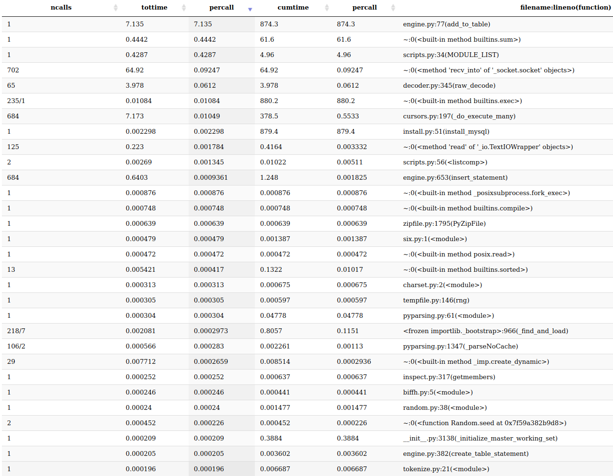
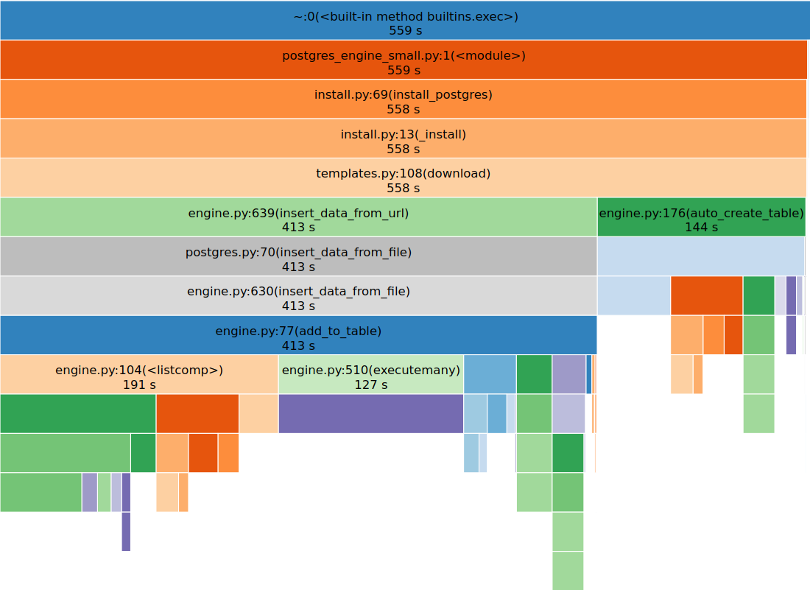

# Data retriever benchmark

A simple test aims to finds bottlenecks of data retriever

### Notes
- This test use `nyc-tree-count`__(226M)__ for large test and `phytoplankton-size` __(83MB)__ for small
- In further progress this test should use vertnet dataset

## Experiment

Note
> both stats are sorted by [time per call in total time](https://jiffyclub.github.io/snakeviz/#interpreting-results)

## Conclusion/Results

__Time for installing the dataset__

| Engine        | phytoplankton-size dataset    | nyc-tree-count dataset  |
| ------------- |:-------------:| -----:|
| csv      | 494 s| 563 s|
| json      | 528 s  |  615 s |
| xml | 591 s |    677 s |
| sqlite | 432 s  | 586 s |
| mysql |  586 s |  880 s |
| postgres | 559 s |  724 s|

----------------------------------
__Bottelnecks methods__

|# | method   | file  |
| ------------- |:-------------:| -----:|
|1 | format_insert_value | csvengine.py |
|2 | format_insert_value | engine.py |
|3 | correct_invalid_value | cleanup.py |
|4 | load_data | engine.py |
|5 | format_insert_value   | jsonengine.py |
|7 | add_to_table  | engine.py|
|8 | get_insert_columns  | table.py|
|9 | auto_get_datatypes  | engine.py|
|10 | format_insert_value  | xmlengine.py|
|11 | format_single_row  | xmlengine.py|
|12 | < listcomp:104 > | engine.py|
|13 | values_from_line | table.py|
|14 | < listcomp:734 >  | engine.py|
|15 | executemany | engine.py|
|16 | format_insert_value | postgres.py|

----------------------------------
__Engines sorted by performance(best-to-worst)__

|#  | Engine  |
|---|:-------:|
| 1 | CSV     |
| 2 | SQLITE  |
| 3 | JSON    |
| 4 | XML     |
| 5 | POSTGRES|
| 6 | MYSQL   |

#### CSV Engine

__phytoplankton-size__ dataset 

__nyc-tree-count__  dataset 

 

-----------------------------------------------------

#### JSON Engine

__phytoplankton-size__ dataset 

__nyc-tree-count__  dataset 

--------------------------------------------------------

#### XML Engine

__phytoplankton-size__ dataset 

__nyc-tree-count__  dataset 

------------------------------------

### SQLITE engine

__phytoplankton-size__ dataset 

__nyc-tree-count__  dataset 

--------------------------------------

### MYSQL engine

__phytoplankton-size__ dataset 

__nyc-tree-count__  dataset 

--------------------------------------

### POSTGRESQL engine

__phytoplankton-size__ dataset 

__nyc-tree-count__  dataset 

-------------------------------------

TODO:

- Add instalation guide to readme

- Improve design and workflow

- Add dynamic datasetnames 

- Live preview depolyment

- Add conclusion